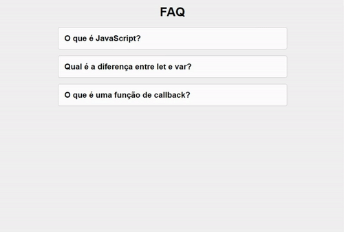

# FAQ Accordion

Projeto desenvolvido em HTML,CSS e Java Script. O site desenvolvido traz a funcionalidade Accordion, muito utilizada em sites para área de dúvidas e respostas.

🔗 [Click here to access](https://n4ju15.github.io/faq_accordion/)

## Tecnologias

- HTML
- CSS
- JavaScript
- Git and Github
